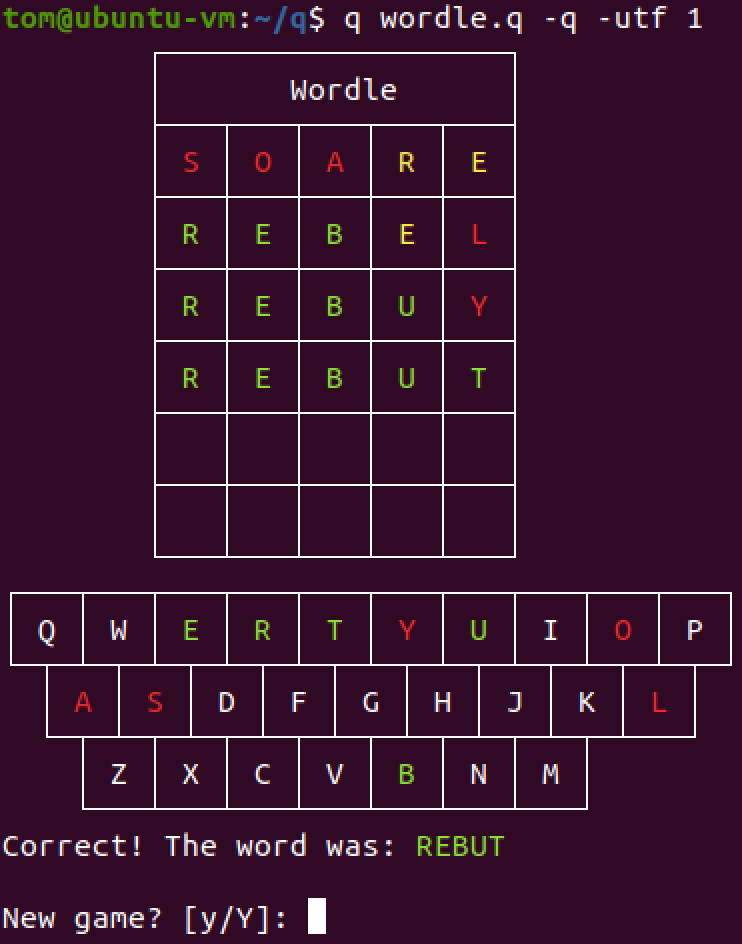

# wordle
q wordle.q -q

* Guess a 5 letter word
* Maximum 6 guesses
* Green indicates right letter in the right place
* Yellow indicates right letter in the wrong place
* Red indicates letter that doesn't exist in the word

